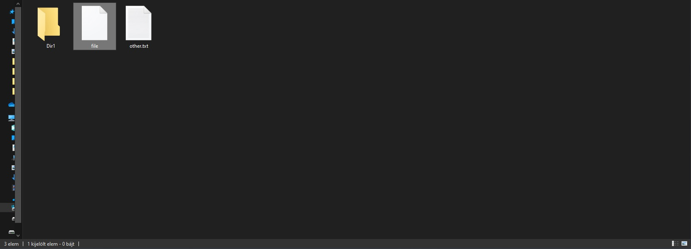

# jFileGoodies
<p><b>Special file utilities for java</b></p>

A set of classes and utilities for files that are probably not available in other utility-libraries and might help you in your project.

This library includes:
 * a `FileGoodies` class that provides a lot of special utilities 
 * a `FormattedFile` class that adds more functionality to the base `java.io.File` class
 * a `FileExplorer` API that lets you to call the native GUI file explorer from java on Windows, Mac and Linux.
 * ...and more to come!

If you have become interested let's jump in to the [User Guide](#user-guide) and [javadoc](https://jfilegoodies-javadoc.herokuapp.com/)!

## <a name="user-guide"></a> User Guide
1. [Compatibility](#compatibility)
2. [Installation](#installation)
   * [Using maven](#installation-maven)
   * [Using gradle](#installation-gradle)
3. [Using jFileGoodies](#using-library)
   * [The FileGoodies class](#FileGoodies-class)
      * [Executable file-extensions](#executable-file-ext)
      * [Shorting file-paths](#file-path-short)
   * [The FormattedFile class](#FormattedFile-class)
      * [Converting a File to a FormattedFile and getting the extension](#FormattedFile-extension)
      * [More](#FormattedFile-more)
   * [The FileExplorer API](#FileExplorer-API)
     
### <a name="compatibility"><a/> Compatibility
**jFileGoodies** is compatible with java 8+ environments.
On Android the minimum API level is 24.
     
### <a name="installation"></a> Installation
##### <a name="installation-maven"></a> Using maven

1. Add the repository:

```xml
<repositories>
	<repository>
	    <id>jitpack.io</id>
	    <url>https://jitpack.io</url>
	</repository>
</repositories>
```

2. Add the dependency:
```xml
<dependency>
	 <groupId>com.github.Dansoftowner</groupId>
	 <artifactId>jFileGoodies</artifactId>
	 <version>1.1</version>
</dependency>
```

##### <a name="installation-gradle"></a> Using gradle

1. Add the repository:
```groovy
repositories {
	//...
	maven { url 'https://jitpack.io' }
}
```

2. Add the dependency:
```groovy
dependencies {
    implementation 'com.github.Dansoftowner:jFileGoodies:1.1'
}
```

### <a name="using-library"></a> Using jFileGoodies
In this section we will cover some features of this library.

#### The `FileGoodies` class

The `com.jfilegoodies.FileGoodies` class provides a lot of 'helper' methods for you.
Let's look at a few!

##### <a name="executable-file-ext"></a> Executable file-extensions
Sometimes, we want to determine that a file is an executable file on the current OS.
Usually, this can be checked based on the file's extension.
On Windows there are executable file-extensions like `exe`, `bat` or `msi`.
On Linux, the focus is not on the file-extensions and any file can be executed, unlike Windows but there are "executable" extensions like `sh` or `bin` etc...

If you want to list these extensions you can use the `FileGoodies.listExecutableExtensions()` method.
```java
List<String> extensions = FileGoodies.listExecutableExtensions();
extensions.forEach(System.out::println);
```
On Windows the code above will print this:
```
exe
bat
bin
cmd
com
... (+ 29)
```

If you want to check that a file is an executable file you can use the `FileGoodies.isOSExecutable(File)` method.
```java
File file = new File("myProgram.exe");
boolean osExecutable = FileGoodies.isOSExecutable(file);
System.out.println("isOsExecutable: " + osExecutable);
``` 
On Windows the code above will print this:
```
isOsExecutable: true
```

Of course, we have also a `FileGoodies.isNotOSExecutable(File)` method.

##### <a name="file-path-short"></a> Shorting file-paths
If you have a file that has a too long absolute-path, and you want to short it, the `FileGoodies.shortenedFilePath` method
is for you!

Let's take an example:<br>
 You have a file: `user\home\documents\work\plan\Example.docx` and
 you want to show only the corresponding directory of the file, and you want to hide the others like this: `.../plan/Example.docx`

In code:
```java
File file = new File("user\\home\\documents\\work\\plan\\Example.docx");
String shortenedPath = FileGoodies.shortenedFilePath(file, 1 /*=> how many parent directories should be visible*/);
System.out.println(shortenedPath);
```
Output:
```
...\plan\Example.docx
```

You can also specify a custom `prefix` which was `...` in the previous example and a custom
`separator` which was `\`.

For more information just go to the [javadoc](https://jfilegoodies-javadoc.herokuapp.com/com/jfilegoodies/FileGoodies.html).

<b>
There are other useful methods available in the `FileGoodies` class, and you can read their
documentation. 
</b>

#### <a name="FormattedFile-class"><a/> The FormattedFile class
The `com.jfilegoodies.FormattedFile` is a subtype of `java.io.File`. 
It has all constructors and methods that a basic `File` object provides.
The most significant difference is that a `FormattedFile` separates the file-name into two different parts:
* a simpleName (the file's name without its extension); Can be retrieved by `FormattedFile.getSimpleName()` 
* an extension; can be retrieved by `FormattedFile.getExtension()`

#### <a name="FormattedFile-extension"></a> Converting a `File` to a `FormattedFile` and getting the extension

Wrapping an existing `File` into a `FormattedFile`:
```java
File file = new File("user/home/documents/work/plan/Example.docx");
FormattedFile formattedFile = new FormattedFile(file);
```
Getting the extension:
```java
System.out.println(formattedFile.getExtension());
// Or a more efficient way:
formattedFile.getExtensionOptional()
        .ifPresent(System.out::println);
```
Output:
```
docx
```

**A `FormattedFile` has more features, take a look at the [javadoc](https://jfilegoodies-javadoc.herokuapp.com/com/jfilegoodies/FormattedFile.html).**

### <a name="FileExplorer-API"></a> The FileExplorer API
The FileExplorer API allows you to open a file in the system file explorer.
It is a feature that probably you rarely want to use, but it's quite interesting.
<i>It works only on desktop environments (Windows, Linux (desktop), MacOS)</i>

Creating a `com.jfilegoodies.explorer.FileExplorer` object:
```java
FileExplorer fileExplorer = FileExplorers.get();
```

Opening a file:
```java
fileExplorer.openSelect(new File("path/to/file"));
```
Result (on Windows):

As you see, the gui file explorer has been opened and selected the file.

**Of course, the FileExplorer API has other features, you can read them in the [javadoc](https://jfilegoodies-javadoc.herokuapp.com/com/jfilegoodies/explorer/FileExplorer.html).**